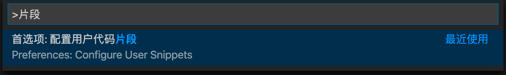
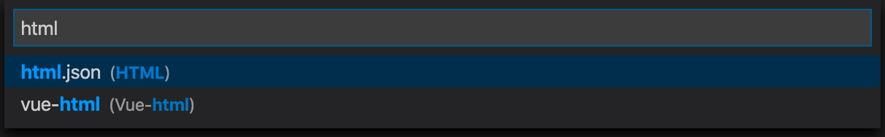

# VSCode 代码片段配置

VSCode 中代码片段，是一段预设好的代码，只需要通过简短的命令，就可以生成大段预设好的代码，省去一定的工作量。

## 配置方式

按 `F1` 或者 `ctrl + shift + p` （windows）、`command + shift + p` （mac）打开命令面板。输入 `片段` 或 `Snippet` 即可找到配置入口。



回车然后选择需要配置的语言进行配置。



配置的语法请参考官方文档：[Creating your own snippets](https://code.visualstudio.com/docs/editor/userdefinedsnippets)

## 配置参考

### .html 配置

```json
{
  "Init PC html": {
    // 初始化PC项目文件
    "prefix": "init-pc",
    "body": [
      "<!DOCTYPE html>",
      "<html lang=\"${1:zh-cmn-Hans}\">",
      "<head>",
        "\t<meta charset=\"UTF-8\">",
        "\t<meta name=\"viewport\" content=\"width=${2:device-width}, initial-scale=${3:1.0}\">",
        "\t<meta http-equiv=\"X-UA-Compatible\" content=\"${4:ie=edge}\">",
        "\t<title>${5:标题}</title>",
      "</head>",
      "<body>",
        "$6",
      "</body>",
      "</html>"
    ],
    "description": "Init PC html"
  },
  "Init mobile html": {
    // 初始化移动端项目文件
    "prefix": "init-mobile",
    "body": [
      "<!DOCTYPE html>",
      "<html lang=\"${1:zh-cmn-Hans}\">",
      "<head>",
        "\t<meta charset=\"UTF-8\">",
        "\t<meta name=\"viewport\" content=\"width=${2:device-width}, initial-scale=${3:1.0}, user-scalable=${4:no}, minimum-scale=${5:1.0}, maximum-scale=${6:1.0}\">",
        "\t<meta http-equiv=\"X-UA-Compatible\" content=\"${7:ie=edge}\">",
        "\t<title>${8:标题}</title>",
      "</head>",
      "<body>",
        "$9",
      "</body>",
      "</html>"
    ],
    "description": "Init mobile html"
  }
}
```

### .vue 配置

```json
{
  "Init vue file": {
    "prefix": "init-vue2",
    "body": [
      "<template>",
        "\t<div class=\"$1\">",
        "\t</div>",
      "</template>\n",
      "<script>",
      "export default {",
        "\tname: '$2',",
      "}",
      "</script>\n",
      "<style scoped lang=\"$3\">",
      "</style>"
    ],
    "description": "初始化.vue文件"
  },
  "Print to console.log": {
    "prefix": "log",
    "body": ["console.log('$1')$2"],
    "description": "输出普通日志到控制台"
  },
  "Print to console.warn": {
    "prefix": "warn",
    "body": ["console.warn('$1')$2"],
    "description": "输出警告日志到控制台"
  },
  "Print to console.error": {
    "prefix": "error",
    "body": ["console.error('$1')$2"],
    "description": "输出错误日志到控制台"
  },
  "Print a try catch": {
		"prefix": "try",
		"body": [
			"try {",
			"\t$1",
			"} catch (error) {",
				"\tconsole.warn(error)",
			"}",
		],
		"description": "Print a try catch"
	}
}
```
