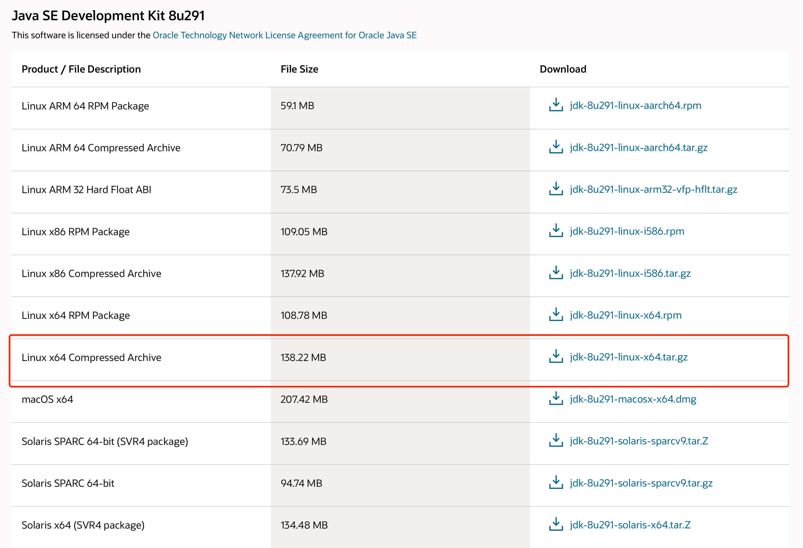
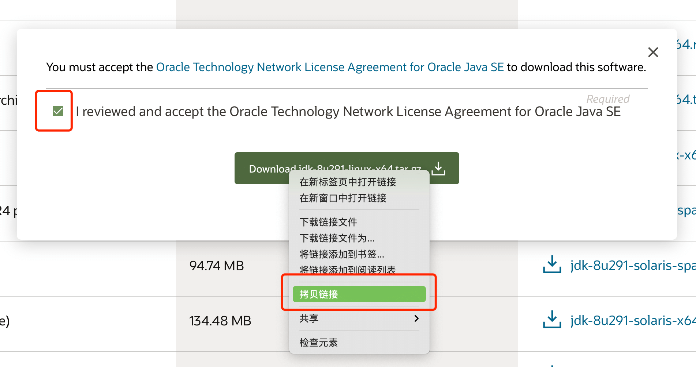

# CentOS7.x 安装 Java 1.8

## 复制下载地址

1. 打开官网 Java 1.8 的[下载页面](https://www.oracle.com/cn/java/technologies/javase/javase-jdk8-downloads.html)，找到 Linux x64 tar 包。

一段时间不见，发现 Oracle 官网改版了，更扁平化。



2. 点击弹出下载弹框，勾选协议并复制下载链接



## 在 linux 上下载并安装

1. 在 /usr/local 下创建 java 目录，并进入

```shell
cd /usr/local && mkdir java && cd java
```

2. wget 下载 tar 包，路径为上面复制的下载路径

```shell
wget -c https://download.oracle.com/otn/java/jdk/8u291-b10/d7fc238d0cbf4b0dac67be84580cfb4b/jdk-8u291-linux-x64.tar.gz
```

3. 解压 tar 包

```shell
tar -xzvf jdk-8u291-linux-x64.tar.gz
```

4. 重命名，为了配置环境变量时简约一些

```shell
mv jdk1.8.0_291 jdk1.8
```

5. 配置系统环境变量

```shell
vim /etc/profile
```

在最下面追加以下环境变量，由于重命名过，只要是安装的 1.8 版本，可直接复制

```shell
JAVA_HOME=/usr/local/java/jdk1.8
JRE_HOME=/usr/local/java/jdk1.8/jre
PATH=$PATH:$JAVA_HOME/bin:$JRE_HOME/bin
CLASSPATH=.:$JAVA_HOME/lib/dt.jar:$JAVA_HOME/lib/tools.jar:$JRE_HOME/lib
export JAVA_HOME JRE_HOME PATH CLASSPATH
```

6. 刷新系统环境变量

```shell
source /etc/profile
```

到此 Java 1.8 安装配置完毕，可查看 Java 版本

```shell
java -version
```

7. 删除 tar 包，节省磁盘空间

```shell
rm -rf jdk-8u291-linux-x64.tar.gz
```
