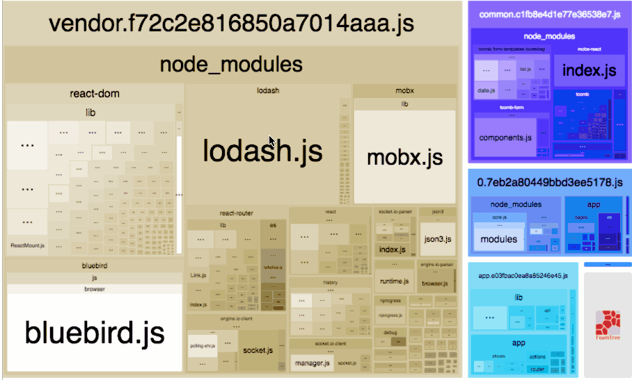
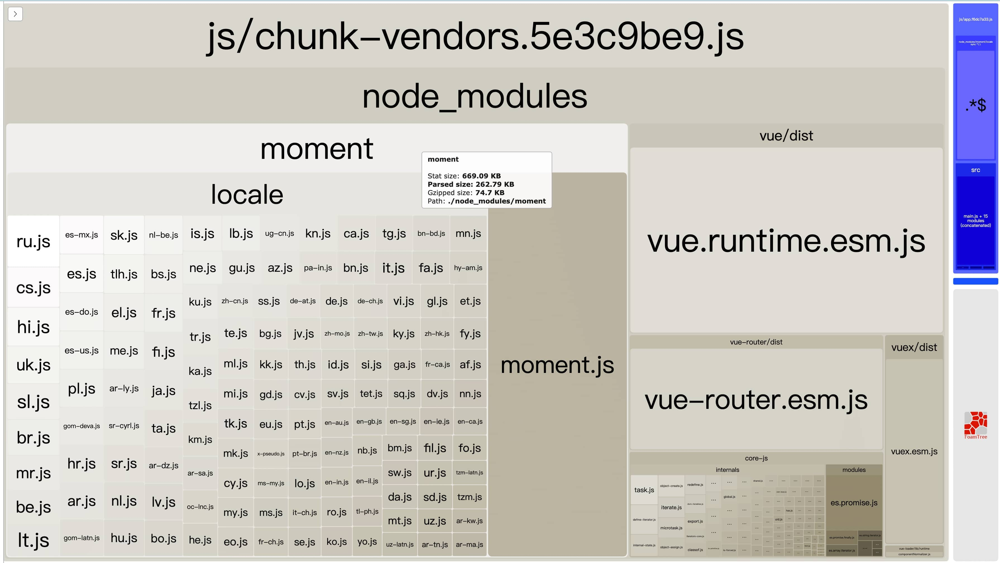
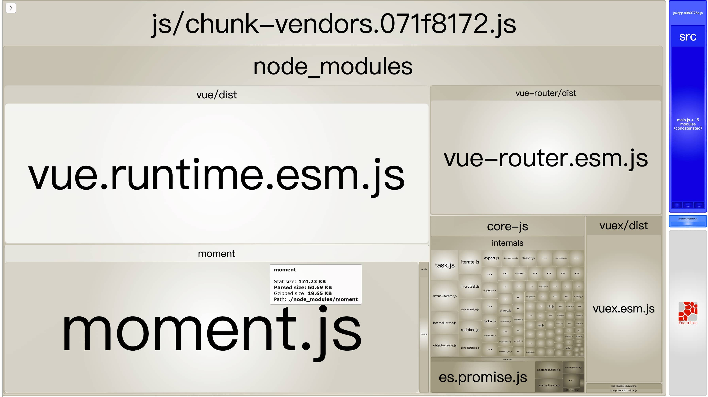
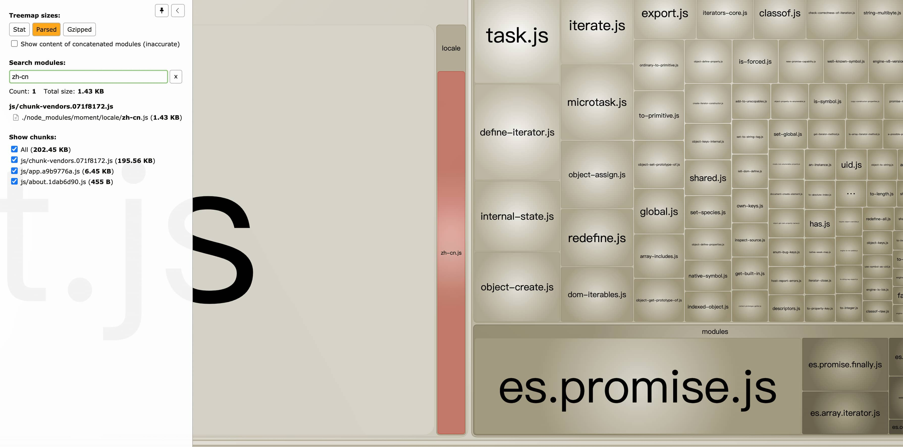
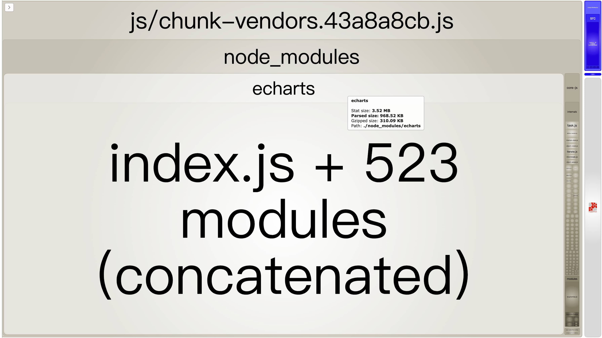
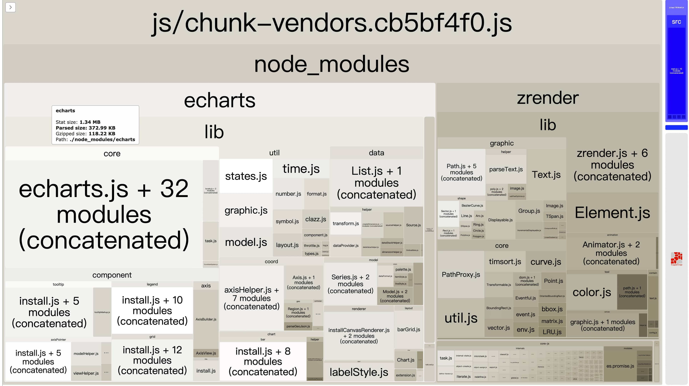
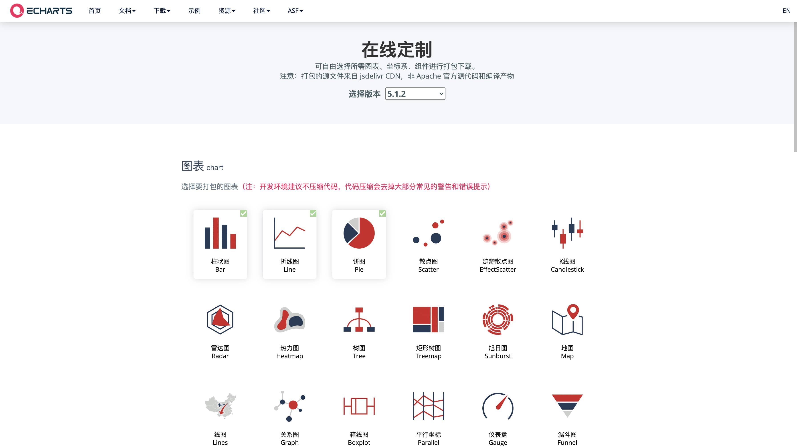
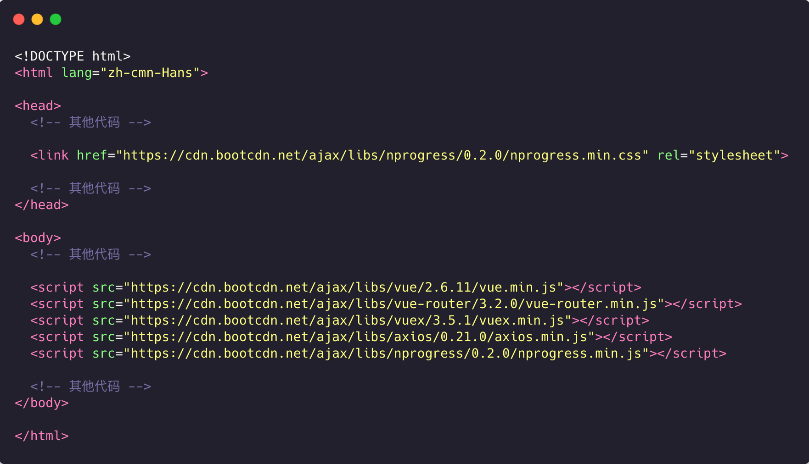
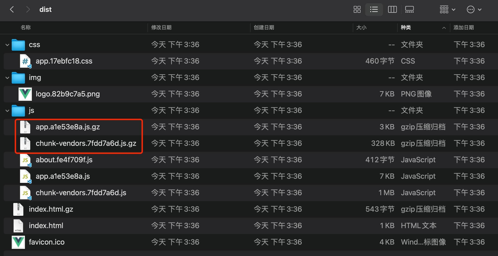

# Vue2.x 项目优化笔记

::: tip 注意
以下 Vue CLI 的相关配置是在 Vue CLI 版本 >= 3.0 的基础上，Vue CLI3 和 Vue CLI4+ 的配置方式有时也不同，请注意自己项目的版本。
:::

## 1. 包内容分析

Vue CLI 集成了 [`webpack-bundle-size-analyzer`](https://github.com/webpack-contrib/webpack-bundle-analyzer) 插件，打包命令提供了 `--report` 和 `--report-json` 两种命令参数来帮助我们分析包中包含的模块们的大小。

- `--report`：生成 report.html 以帮助分析包内容
- `--report-json`：生成 report.json 以帮助分析包内容

所以我们可以自定义一个 `npm script`，在 `package.json` 中的 `scripts` 属性值中追加：

```json
"build:report": "vue-cli-service build --report --report-json",
```

想生成带有分析报告的打包文件时，敲 `npm run build:report`

`report.html` 打开后显示如下：



## 2. 优化措施

### 2.1 路由懒加载

[Vue Router 官网介绍](https://router.vuejs.org/zh/guide/advanced/lazy-loading.html#%E8%B7%AF%E7%94%B1%E6%87%92%E5%8A%A0%E8%BD%BD)

原理是把不同路由对应的组件分割成不同的代码块，然后当路由被访问的时候才加载对应组件，提升加载速度。

使用示例：

```js
const router = new VueRouter({
  routes: [{ path: '/foo', component: () => import('./Foo.vue') }]
})

// or

const Foo = () => import('./Foo.vue')
const router = new VueRouter({
  routes: [{ path: '/foo', component: Foo }]
})
```

### 2.2 异步组件

[Vue 官网介绍](https://cn.vuejs.org/v2/guide/components-dynamic-async.html#%E5%BC%82%E6%AD%A5%E7%BB%84%E4%BB%B6)

在大型应用中，我们可能需要将应用分割成小一些的代码块，并且只在需要的时候才从服务器加载一个模块。异步组件契合按需加载的需求。

#### 定义全局异步组件

```js
Vue.component('async-webpack-example', function (resolve) {
  // 这个特殊的 `require` 语法将会告诉 webpack
  // 自动将你的构建代码切割成多个包，这些包
  // 会通过 Ajax 请求加载
  require(['./my-async-component'], resolve)
})

// or

Vue.component(
  'async-webpack-example',
  // 这个动态导入会返回一个 `Promise` 对象。
  () => import('./my-async-component')
)
```

#### 注册局部异步组件

```js
new Vue({
  // ...
  components: {
    'my-component': () => import('./my-async-component')
  }
})
```

### 2.3 生产环境禁止输出 SourceMap

`SourceMap` 文件可以使浏览器能够像调试源代码一样调试被混淆压缩后的 `JavaScript` 代码，所以在非生产环境，`SourceMap` 对于调试是有利的。

但是 `SourceMap` 文件有一定的安全隐患，有心人士可以通过 `SourceMap` 文件中的映射，更容易地还原出前端完整代码。

所以生产环境应该禁止输出 `SourceMap`，这样既可以加速生产环境的构建，又可以规避一部分信息安全问题。

Vue CLI 的 `productionSourceMap` 配置可以控制生产环境不输出 `SourceMap` 文件：

```js
// vue.config.js
module.exports = {
  // 如果你不需要生产环境的 source map
  productionSourceMap: false
}
```

### 2.4 生产环境禁止日志打印和 debugger

Vue CLI 内置了 `terser-webpack-plugin` 插件，使用它可以控制是否移除日志打印和 `debugger`。

#### 2.4.1 Vue CLI 3 配置方式

```js
// vue.config.js

const TerserPlugin = require('terser-webpack-plugin')
module.exports = {
  chainWebpack: config => {
    if (process.env.NODE_ENV === 'production') {
      config.optimization.minimizer([
        new TerserPlugin({
          terserOptions: {
            compress: {
              // 移除所有的日志打印
              // drop_console: true,
              // 移除所有的 debugger
              drop_debugger: true,
              // 该配置可以只移除一部分 log，但是必须设置 drop_console 为 false，如果值为 ['console.*'] 也是移除所有
              pure_funcs: ['console.log']
            }
          }
        })
      ])
    }
  }
}
```

#### 2.4.2 Vue CLI 4+ 配置方式

```js
// vue.config.js

module.exports = {
  chainWebpack: config => {
    config.when(process.env.NODE_ENV === 'production', config => {
      config.optimization.minimizer('terser').tap(args => {
        // 移除所有的日志打印
        // args[0].terserOptions.compress["drop_console"] = true;
        // 移除所有的 debugger
        args[0].terserOptions.compress['drop_debugger'] = true
        args[0].terserOptions.compress['pure_funcs'] = ['console.log']
        return args
      })
    })
  }
}
```

### 2.5 分割大块代码

Vue CLI 内置了 `SplitChunksPlugin` 插件，使用它可以把大的代码快分割成小的代码。把一个大的文件的加载转变为多个小文件的并行加载，从而提高加载速度。

一般情况下，默认的配置就可以满足常规需求，默认配置如下：

```js
// vue.config.js

module.exports = {
  chainWebpack: config => {
    config.optimization.splitChunks({
      chunks: 'async', // 处理的 chunk 类型
      minSize: 20000, // 允许新拆出 chunk 的最小体积
      minRemainingSize: 0,
      minChunks: 1, // 拆分前被 chunk 公用的最小次数
      maxAsyncRequests: 30, // 每个异步加载模块最多能被拆分的数量
      maxInitialRequests: 30, // 每个入口和它的同步依赖最多能被拆分的数量
      enforceSizeThreshold: 50000, // 强制执行拆分的体积阈值并忽略其他限制
      cacheGroups: {
        // 缓存组
        defaultVendors: {
          test: /[\\/]node_modules[\\/]/, // 模块路径/文件名匹配正则
          priority: -10, // 缓存组权重
          reuseExistingChunk: true // 复用已被拆出的依赖模块，而不是继续包含在该组一起生成
        },
        default: {
          minChunks: 2, // default 组的模块必须至少被 2 个 chunk 共用 (本次分割前)
          priority: -20,
          reuseExistingChunk: true
        }
      }
    })
  }
}
```

我使用的是以下自定义配置：

```js
// vue.config.js

module.exports = {
  chainWebpack: config => {
    config.optimization.splitChunks({
      chunks: 'all',
      minSize: 20000,
      automaticNameDelimiter: '-',
      cacheGroups: {
        vendor: {
          test: /[\\/]node_modules[\\/]/,
          name(module) {
            const packageName = module.context.match(
              /[\\/]node_modules[\\/](.*?)([\\/]|$)/
            )[1]
            return `chunk.${packageName.replace('.', '-').replace('@', '')}`
          },
          priority: 10
        }
      }
    })
  }
}
```

### 2.6 常用依赖的优化

::: tip 提示
以下优化针对于没有使用 CDN 的依赖，如果以下依赖已经托管给了 CDN，可以忽略。
:::

#### 2.6.1 Moment.js 2.x

[`Moment.js`](https://momentjs.com/) 是老牌的日期处理工具，正因为老牌，所以不能按需引入，其次通过分析图可见，打包后的 `Moment.js` 除了主包外，还有大量的语言包，占用体积比较大。



优化方案有两种：

- 弃用 `Moment.js`，使用可以按需加载的 [`Day.js`](https://dayjs.gitee.io/zh-CN/) 或 [`date-fns`](https://date-fns.org/)
- 去除冗余的语言包

第一种方案简单直接，`Day.js` 和 `date-fns` 使用就不展开细讲了，感兴趣的可以移步官网。

下面讲讲第二种。

参考 [《How to optimize moment.js with webpack》](https://github.com/jmblog/how-to-optimize-momentjs-with-webpack)，可以使用 `webpack.IgnorePlugin()` 忽略 `Moment.js` 语言包，手动引入的语言包会被打包进 `chunk-vendors` 中。

```js
// vue.config.js
const webpack = require('webpack')

configureWebpack: {
  plugins: [
    new webpack.IgnorePlugin({
      resourceRegExp: /^\.\/locale$/,
      contextRegExp: /moment$/
    })
  ]
}

//
chainWebpack: config => {
  config
    .plugin('ignore')
    // 忽略 moment/locale 下的所有文件，优化 moment 的体积
    // https://github.com/jmblog/how-to-optimize-momentjs-with-webpack
    .use(new webpack.IgnorePlugin(/^\.\/locale$/, /moment$/))
}
```

假设我们只引入了简体中文包，效果如下：

```js
import moment from 'moment'
import 'moment/locale/zh-cn'

moment.locale('zh-cn')

console.log('现在时间：', moment().format('MMMM')) // 现在时间： 八月
```





#### 2.6.2 Lodash 4.x

很多文章对于 `Lodash` 的优化，都是使用 `lodash-webpack-plugin` 这个插件，但是实际使用下来会有很多的问题，详情请见黑猫的[《为什么你应该立即停止使用 lodash-webpack-plugin》](https://zhuanlan.zhihu.com/p/349260482)。

并且在不出错的情况下 `lodash-webpack-plugin` 这个插件的效果与 `import { head } from 'lodash-es'` 和 `import head from 'lodash/head'` 的效果几乎一致，它只是针对于 `import { head } from 'lodash'` 这种形式的引入做了优化处理。

```js
// 整个 lodash 都会被打包，压缩后 72K
import { head } from 'lodash'
head([1, 2, 3])

// 打包压缩后 1K
import { head } from 'lodash-es'
head([1, 2, 3])

// 打包压缩后 1K
import head from 'lodash/head'
head([1, 2, 3])
```

得益于 ES6+ 的各种黑科技，其实在大多数情况下，我们对于 `Lodash` 和 `Underscore` 等工具函数库的需求并不大，很多方法都有替代方案。详情请见 [《You don't (may not) need Lodash/Underscore》](https://github.com/you-dont-need/You-Dont-Need-Lodash-Underscore)。

所以我对于 `Lodash` 的优化建议是：

- 如果需求不大就弃用；
- 如果需求真的很大，就使用 `lodash-es` 或手动按需引入。
- 或者等待模块化的 `Lodash` 现世

#### 2.6.3 ECharts 5.x

ECharts 的图表非常丰富，这也导致了它的全量包体积很大，如果全量引入：



有两种方式可以做到按需引入

**第一种：按需引入 ECharts 图表和组件**

从 5.x 开始，官方提供了[新的按需引入方式](https://echarts.apache.org/zh/tutorial.html#%E5%9C%A8%E6%89%93%E5%8C%85%E7%8E%AF%E5%A2%83%E4%B8%AD%E4%BD%BF%E7%94%A8%20ECharts)

```js
// 引入 echarts 核心模块，核心模块提供了 echarts 使用必须要的接口。
import * as echarts from 'echarts/core'
// 引入柱状图图表，图表后缀都为 Chart
import { BarChart } from 'echarts/charts'
// 引入提示框，标题，直角坐标系组件，组件后缀都为 Component
import {
  TitleComponent,
  TooltipComponent,
  GridComponent
} from 'echarts/components'
// 引入 Canvas 渲染器，注意引入 CanvasRenderer 或者 SVGRenderer 是必须的一步
import { CanvasRenderer } from 'echarts/renderers'

// 注册必须的组件
echarts.use([
  TitleComponent,
  TooltipComponent,
  GridComponent,
  BarChart,
  CanvasRenderer
])
```

可以选择把 `echarts` 注册在 Vue 原型上

```js
// main.js

import Vue from 'vue'

Vue.prototype.$echarts = echarts
```

来看一下效果：



**第二种：使用官方的在线定制功能**

如果你觉得按需引入的方式心智负担很重，也可以选择使用官方的[在线定制功能](https://echarts.apache.org/zh/builder.html)按需生成 `echarts.min.js` 文件。



### 2.7 CDN 优化

::: tip 提示
不要盲目的把所有依赖都更换成第三方 CDN 方式引入，我觉得这个优化点需要分情况讨论。
:::

#### 2.7.1 假设公司有 CDN 服务器

第三方的 CDN 其实不一定可信，起码不可能一直可信，假设公司有自己的 CDN 服务器，那就最好了。

这时候除了 `index.html` 的所有静态资源（包括 `js`、`css`、`图片`、`视频`、`字体`等）都可以部署到 CDN 服务器上，这样本地的静态资源和依赖该怎么引入还怎么引入，完全不需要变动，只需要打包的时候 Vue CLI 的 `assetsDir` 配置为 CDN 对应路径。

至于为什么不连 `index.html` 也一起放在 CDN，如果这个网站是公司内部使用，可以放；如果是对外的站点，一是让用户用 CDN 路径去访问站点不太合适，二是 `index.html` 放在域名对应的服务器可以更方便的做网关层面的操作，比如 IP 限流、反向代理等。

```js
// vue.config.js

module.exports = {
  assetsDir: process.env.NODE_ENV === 'production' ? 'path/to/your/CDN' : ''
}
```

#### 2.7.2 假设公司 IT 部门很严格，屏蔽了第三方 CDN 站点

大公司的 IT 部门监管一般很严格，这时候就不要考虑使用第三方 CDN 了，我就遇到过本来能正常使用的 CDN，过段时间发现被 IT 部门屏蔽了。再说大型企业一般都有自己的 CDN 服务器。

#### 2.7.3 假设公司的服务器配置非常给力

可以不用考虑使用第三方 CDN。

#### 2.7.4 最后来讨论可以用 CDN 优化的场景

上面三种情况只是举例，具体是否使用 CDN，要综合评估加载速度和总包流量，还请自行考量。

哪些依赖可以使用 CDN 呢？我的思路是针对那些必须全量引入的依赖，比如 `Vue`、`Vue Router`、`Vuex`、`Axios`、`NProgress`、`JQuery` 等。

像 `Element`、`Antd Vue` 这些 UI 框架，我选择不使用 CDN，因为它们本身可以按需引入，并且如果使用 CDN，改变主题颜色等操作就会变得复杂。当然如果你觉得使用 CDN 带来的加载速度提升大大优于不使用 CDN，并且没有动态改变主题等需求，那当然可以走 CDN。

其次要考虑，开发环境要和生产环境得区分开来，开发环境还是要使用本地的依赖，不然没有代码提示太痛苦了，效率也会降低。

另外 Vue CLI 帮我们集成了 [html-webpack-plugin](https://github.com/jantimon/html-webpack-plugin#options) 插件，我们可以基于该插件，只在生产环境使用 CDN。

`vue.config.js` 修改如下：

```js
// vue.config.js

const CDN_CONFIGS = {
  externals: {
    vue: 'Vue',
    'vue-router': 'VueRouter',
    vuex: 'Vuex',
    axios: 'axios',
    nprogress: 'NProgress'
  },
  links: [
    'https://cdn.bootcdn.net/ajax/libs/nprogress/0.2.0/nprogress.min.css'
  ],
  scripts: [
    'https://cdn.bootcdn.net/ajax/libs/vue/2.6.11/vue.min.js',
    'https://cdn.bootcdn.net/ajax/libs/vue-router/3.2.0/vue-router.min.js',
    'https://cdn.bootcdn.net/ajax/libs/vuex/3.5.1/vuex.min.js',
    'https://cdn.bootcdn.net/ajax/libs/axios/0.21.0/axios.min.js',
    'https://cdn.bootcdn.net/ajax/libs/nprogress/0.2.0/nprogress.min.js'
  ]
}

module.exports = {
  chainWebpack: config => {
    config.when(process.env.NODE_ENV === 'production', config => {
      config.set('externals', CDN_CONFIGS.externals)

      config.plugin('html').tap(args => {
        args[0].USE_CDN = true
        args[0].links = CDN_CONFIGS.links
        args[0].scripts = CDN_CONFIGS.scripts
        return args
      })
    })
  }
}
```

`index.html` 中使用 [EJS](https://ejs.bootcss.com/#promo) 的语法引入样式和脚本，如下：

```html
<!-- index.html -->
<!DOCTYPE html>
<html lang="zh-cmn-Hans">
  <head>
    <!-- 其他代码... -->

    <!-- CDN 引入CSS -->
    <% if (htmlWebpackPlugin.options.USE_CDN) { %> <%
    htmlWebpackPlugin.options.links.forEach(function (link) { %>
    <link href="<%= link %>" rel="stylesheet" />
    <% }) %> <% } %>
  </head>

  <body>
    <!-- 其他代码... -->

    <!-- CDN 引入JS -->
    <% if (htmlWebpackPlugin.options.USE_CDN) { %> <%
    htmlWebpackPlugin.options.scripts.forEach(function (script) { %>
    <script src="<%= script %>"></script>
    <% }) %> <% } %>
  </body>
</html>
```

打包之后的 `index.html` 代码如下：



> webpack 的 [外部扩展 Externals](https://webpack.js.org/configuration/externals/#externals)，让程序可以在运行时再去从外部获取扩展依赖。所以在使用 CDN 时，只要是定义好的外部扩展，项目中 `import xxx from ‘xxx’` 的引入方式依然可以正常运行，不需要做任何改动。

### 2.8 Gzip 压缩

Gzip 是一种用于文件压缩与解压缩的文件格式。以 Nginx 为例，有两种方式开启 Gzip。

#### 2.8.1 利用 ngx_http_gzip_module 模块实时压缩

通过 `ngx_http_gzip_module` 模块拦截请求，并对需要做 Gzip 的资源进行实时压缩，会消耗 CPU 资源。

`ngx_http_gzip_module` 模块是 Nginx 默认集成的，不需要额外编译安装。

配置示例：

```shell
# 开启 Gzip
gzip on;

# 设置允许压缩的文件最小字节数
gzip_min_length 1k;

# 设置压缩级别，取值 1-9，数字越大压缩的越好，也更消耗 CPU 的资源和时间
gzip_comp_level 2;

# 设置允许进行压缩的文件类型。JavaScript 有多种形式。其中的值可以在 mime.types 文件中找到。
gzip_types text/plain application/javascript application/x-javascript text/css application/xml text/javascript application/x-httpd-php image/jpeg image/gif image/png application/vnd.ms-fontobject font/ttf font/opentype font/x-woff image/svg+xml;

# 是否在 HTTP header 中添加 Vary: Accept-Encoding，建议开启
gzip_vary on;

# IE 6 及以下 禁用
gzip_disable "MSIE [1-6]\.";

# 设置压缩所需要的缓冲区大小
gzip_buffers 4 16k;

# 设置压缩针对的 HTTP 协议版本
gzip_http_version 1.0 | 1.1;
```

#### 2.8.2 利用 http_gzip_static_module 模块静态压缩

`http_gzip_static_module` 模块不消耗 CPU 资源，该模块需要额外安装。

开启很简单：

```shell
gzip_static  on;
```

`http_gzip_static_module` 模块需要我们实现准备好压缩好的资源。前端需要利用到 `compression-webpack-plugin` 这个 webpack 插件，在打包的时候同时生成 `.gz` 格式的文件。

1. 安装 `compression-webpack-plugin`

不要安装版本 7.x 或者 8.x，会报以下错误：

```shell
TypeError: Cannot read property 'tapPromise' of undefined
```

只能安装低版本的 6.x 或 5.x：

```shell
npm i -D compression-webpack-plugin@6.x
# or
yarn add -D compression-webpack-plugin@6.1.1
```

2. vue.config.js 配置：

```js
// vue.config.js

const CompressionWebpackPlugin = require('compression-webpack-plugin')

module.exports = {
  chainWebpack: config => {
    config.when(process.env.NODE_ENV === 'production', config => {
      config.plugin('compression').use(
        new CompressionWebpackPlugin({
          filename: '[path][base].gz',
          algorithm: 'gzip',
          test: /\.js$|\.css$|\.html$/,
          // 仅处理大于此大小的资源（以字节为单位），
          threshold: 1024,
          minRatio: 0.8
        })
      )
    })
  }
}
```

压缩效果如下，所有大于 `1kb` 的资源都生成了同名的 `.gz` 文件：



#### 2.8.3 实时压缩和静态压缩结合使用

实时压缩和静态压缩可以结合使用，效果更佳。Nginx 会首先尝试使用静态压缩，如果有则直接返回 `.gz` 的预压缩文件，否则尝试动态压缩。

```shell
gzip_static       on;

gzip              on;
gzip_min_length   1k;
gzip_comp_level   1;
gzip_types        text/plain application/javascript application/x-javascript text/css application/xml text/javascript application/x-httpd-php image/jpeg image/gif image/png application/vnd.ms-fontobject font/ttf font/opentype font/x-woff image/svg+xml;
gzip_vary         on;
gzip_disable      "MSIE [1-6]\.";
gzip_buffers      4 16k;
gzip_http_version 1.0 | 1.1;
```
