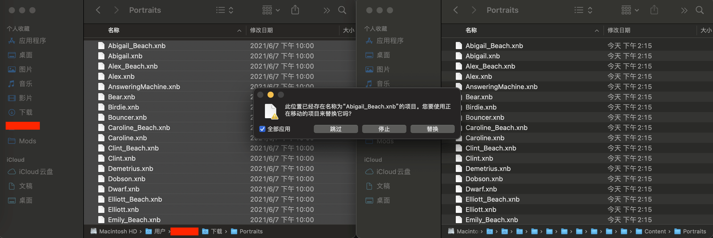

# MacOS 安装「星露谷物语」模组

可以先看看[官方教程](https://stardewvalleywiki.com/Modding:Installing_SMAPI_on_Mac)，这篇博文是对官方教程的补充和展开。

## 准备工作

### 先安装好星露谷物语

请在安装好星露谷物语之后再继续操作。

### Mono

::: tip 注意
官方的教程里面，提示 `As of the upcoming SMAPI 3.13.0: Install [.NET 5](https://dotnet.microsoft.com/download/dotnet/5.0) instead.`，从即将推出的 SMAPI 3.13.0 开始，改为安装 `.NET 5`。我此刻的 SMAPI 最新版本是 `3.12.8`，如果你看到这篇教程时，版本已经到了 `3.13.0+`，请安装 [.NET 5](https://dotnet.microsoft.com/download/dotnet/5.0)。
:::

**Mono** 是一个软件平台，旨在允许开发人员轻松创建 [.NET Foundation 的](https://www.dotnetfoundation.org/)跨平台应用程序部分。

也就是说，Mono 可以让 MacOS 运行 Windows 的软件。

#### 下载 Mono

打开[官网](https://www.mono-project.com/download/stable/)，点击 `Download Mono 6.12.0 (Stable channel)` 下载稳定版本。不建议下载 Visual Studio 的版本。

#### 安装 Mono

双击打开安装包，按步骤安装，安装位置选**Macintosh HD**。

### SMAPI

`SMAPI` 是**星露谷物语**的模组加载器。

#### 下载 SMAPI

打开[官网](https://smapi.io/)，点击 `Download SMAPI 3.12.8` 按钮，选择 `Direct download` 直接下载安装包。

#### 安装 SMAPI

解压后，双击打开 `SMAPI 3.12.8 installer` 文件夹里的 `install on macOS.command` 文件。

可能会提示一下无法安装的信息。

不要慌，在 Mac 的「系统偏好设置」-「安全性与隐私」-「通用」中可以看到 `已阻止使用“install on macOS.command”，因为来自身份不明的开发者。`。

点击`仍要打开`。

SMAPI MacOS 安装程序会自动启动终端，接下来有三步需要在终端操作。

1. 需要选择文字主题，这里我选择`2`，输入`2`然后回车。

2. 需要选择安装路径，如果你已经安装了星露谷物语，它会自动识别到，只需要输入`1`然后回车。

3. 需要选择是**安装**还是**卸载**，选`1`进行安装。

最后可以看到安装成功的提示。

同时该窗口包含游戏安装目录，如果你在上一步选择的是默认目录，一般路径为 `/Users/<你的 MacOS 当前用户名>/Library/Application Support/Steam/steamapps/common/Stardew Valley/Contents/MacOS/`。复制保存下来，待会儿引入模组的需要用到。

## 正式引入模组

前面的都是模组安装的准备工作，接下来介绍怎么下载和安装模组。

### 下载模组

我的模组都是在 [NEXUSMODS（N 网）](https://www.nexusmods.com/stardewvalley/mods/) 下载的。

N 网的模组下载都是免费的，下载界面上会有赞助开发者的提示，有条件的可以支持一下。

::: tip 提示
模组其实分为两类：一类是「皮肤模组」，不影响游戏本身的功能，只是改变外貌；还有一类是「功能性模组」，会改变游戏本身的流程或功能。
:::

我先以 [Skip Fishing Minigame（跳过钓鱼小游戏）](https://www.nexusmods.com/stardewvalley/mods/2697) 这个模组为例，简单介绍下怎么下载模组。

- 先查看该模组的安装要求，有些模组会依赖于其他模组。如果要求里面只有 SMAPI，直接下载不用担心；如果依赖于其他模组，需要把依赖的模组也一起下载。

- 这里 Skip Fishing Minigame 不依赖于其他模组，直接点击 `MANUAL` 按钮，或者滚动到下面，选择历史版本，点击历史版本的 `MANUAL DOWNLOAD`。在弹框中点击 `DOWNLOAD`；

- 如果你没有登录，它会提示你必须先登录才能下载。

::: tip 注意
如果你是没有账户，注册的时候有可能会需要你交互验证，这时候可能需要`科学上网`才能完成验证……至于如何科学上网……请自行摸索。
:::

- 最后选择 `SLOW DOWNLOAD`，白嫖下载，速度比较慢。有条件的等不及的可以交个会员快速下载。

### 安装模组

打开「访达」，在顶部操作菜单中，点击「前往」-「前往文件夹」。

在弹出框中输入之前复制的游戏路径，回车或点击「前往」。

该游戏目录下面的 `Mods` 文件夹即是「功能性模组」存放的文件夹。可以看到里面已经有了三个模组，这是 SMAPI 自动帮我们安装的，不用管。

#### 安装「功能性模组」

把刚刚下载的模组解压，并整个复制到 `Mods` 文件夹。

打完收工，是不是很简单。

#### 安装「皮肤模组」

一般皮肤类模组，在下载的时候，下载界面上会提示怎么安装。即**将此「portraits」文件夹的文件粘贴到「...Stardew Valley/Content/Portraits」文件夹中**。

不过这里标注的是 Windows 的路径，MacOS 路径为 `/Users/<你的 MacOS 当前用户名>/Library/Application Support/Steam/steamapps/common/Stardew Valley/Contents/Resources/Content/Portraits`

::: tip 提示
皮肤类模组的本质就是*替换贴图*，所以最好备份一下默认的「portraits」文件夹，防止下的模组还没有原版好看，留一枚后悔药。
:::

### 启动星露谷检查模组是否正确加载

安装了 SMAPI 后，每次启动星露谷物语，都会自动弹出一个终端界面，这个界面展示的是游戏启动的进程信息，关闭终端界面即是关闭游戏。一开始的界面中会展示「功能性模组」的加载信息。

如果界面中有标红的 `Error` 字样，说明你刚刚添加的模组可能不兼容当前游戏（也可能是其他原因，具体原因看日志打印），建议更换或删除掉。

## 模组推荐

<table>
  <thead>
    <tr>
      <th>英文名</th>
      <th>中文名</th>
      <th>编号</th>
      <th>链接</th>
      <th>备注</th>
    </tr>
  </thead>
  <tbody>
    <tr>
      <td>Content Patcher</td>
      <td>内容修补程序</td>
      <td>1915</td>
      <td>
        <a
          href="https://www.nexusmods.com/stardewvalley/mods/1915"
          target="_blank"
        >
          点我跳转
        </a>
      </td>
      <td>
        这是一个游戏内容修补的程序，很多功能性模组都需要依赖它才能生效，最好装一下。
      </td>
    </tr>
    <tr>
      <td>stardewvalley anime mods</td>
      <td>村民动漫皮肤</td>
      <td>1839</td>
      <td>
        <a
          href="https://www.nexusmods.com/stardewvalley/mods/1839"
          target="_blank"
        >
          点我跳转
        </a>
      </td>
      <td>
        皮肤模组，人气很高的动漫风格皮肤。
      </td>
    </tr>
    <tr>
      <td>Skip Fishing Minigame</td>
      <td>跳过钓鱼小游戏</td>
      <td>2697</td>
      <td>
        <a
          href="https://www.nexusmods.com/stardewvalley/mods/2697"
          target="_blank"
        >
          点我跳转
        </a>
      </td>
      <td>
        1. 前期快速通过钓鱼积累金钱； 2. 轻松钓鱼王
      </td>
    </tr>
    <tr>
      <td>Visible Fish - see catchable fish in the water</td>
      <td>显示可以钓到的鱼</td>
      <td>8897</td>
      <td>
        <a
          href="https://www.nexusmods.com/stardewvalley/mods/8897"
          target="_blank"
        >
          点我跳转
        </a>
      </td>
      <td>
        可以在水中看到可以钓到的鱼或者物品的贴图
      </td>
    </tr>
    <tr>
      <td>Gift Taste Helper</td>
      <td>礼物助手</td>
      <td>229</td>
      <td>
        <a
          href="https://www.nexusmods.com/stardewvalley/mods/229"
          target="_blank"
        >
          点我跳转
        </a>
      </td>
      <td>
        只要是有人物头像的地方，鼠标移上去可以看到角色最爱的礼物，缺点是看不到喜欢或着一般的礼物
      </td>
    </tr>
    <tr>
      <td>Simple Crop Label</td>
      <td>简易农作物标签</td>
      <td>314</td>
      <td>
        <a
          href="https://www.nexusmods.com/stardewvalley/mods/314"
          target="_blank"
        >
          点我跳转
        </a>
      </td>
      <td>
        鼠标移到农作物或者树木上，可以看到对应的名字
      </td>
    </tr>
    <tr>
      <td>Skull Cavern Elevator</td>
      <td>骷髅洞穴电梯</td>
      <td>963</td>
      <td>
        <a
          href="https://www.nexusmods.com/stardewvalley/mods/963"
          target="_blank"
        >
          点我跳转
        </a>
      </td>
      <td>
        让骷髅洞穴的矿洞也拥有电梯功能，不用为下矿而烦恼。
      </td>
    </tr>
    <tr>
      <td>Simple Foliage</td>
      <td>简易树叶</td>
      <td>8164</td>
      <td>
        <a
          href="https://www.nexusmods.com/stardewvalley/mods/8164"
          target="_blank"
        >
          点我跳转
        </a>
      </td>
      <td>
        皮肤模组，让树木更好看一些。
      </td>
    </tr>
    <tr>
      <td>Friends Forever</td>
      <td>永远的朋友</td>
      <td>1738</td>
      <td>
        <a
          href="https://www.nexusmods.com/stardewvalley/mods/1738"
          target="_blank"
        >
          点我跳转
        </a>
      </td>
      <td>
        不用担心掉友好度，如果不是想攻略的村民，礼物随便送。
      </td>
    </tr>
    <tr>
      <td>Fishing Made Easy Suite</td>
      <td>让钓鱼变得容易</td>
      <td>3623</td>
      <td>
        <a
          href="https://www.nexusmods.com/stardewvalley/mods/3623"
          target="_blank"
        >
          点我跳转
        </a>
      </td>
      <td>
        让鱼在任何时间、季节、天气出现，让传说中的鱼可以重新捕捉，让五彩碎片成为可以钓鱼的物品，让你的农场池塘可以钓鱼，改变鱼食物品的要求，并增加鱼卖价
      </td>
    </tr>
    <tr>
      <td>No Fence Decay</td>
      <td>没有栅栏腐烂</td>
      <td>1180</td>
      <td>
        <a
          href="https://www.nexusmods.com/stardewvalley/mods/1180"
          target="_blank"
        >
          点我跳转
        </a>
      </td>
      <td>
        让栅栏和大门不会烂掉。
      </td>
    </tr>
    <tr>
      <td>Wear More Rings</td>
      <td>多戴戒指</td>
      <td>3214</td>
      <td>
        <a
          href="https://www.nexusmods.com/stardewvalley/mods/3214"
          target="_blank"
        >
          点我跳转
        </a>
      </td>
      <td>
        可以让主角戴更多的戒指。注意该模组依赖于
        <a
          href="https://www.nexusmods.com/stardewvalley/mods/5098"
          target="_blank"
        >
          Generic Mod Config Menu
        </a>
        和
        <a
          href="https://www.nexusmods.com/stardewvalley/mods/3213"
          target="_blank"
        >
          StardewHack
        </a>
      </td>
    </tr>
    <tr>
      <td>Stardew Valley Expanded</td>
      <td>星露谷扩张</td>
      <td>3753</td>
      <td>
        <a
          href="https://www.nexusmods.com/stardewvalley/mods/3753"
          target="_blank"
        >
          点我跳转
        </a>
      </td>
      <td>
        后期通关了之后，可以尝试，前期我觉得没必要。
      </td>
    </tr>
  </tbody>
</table>
