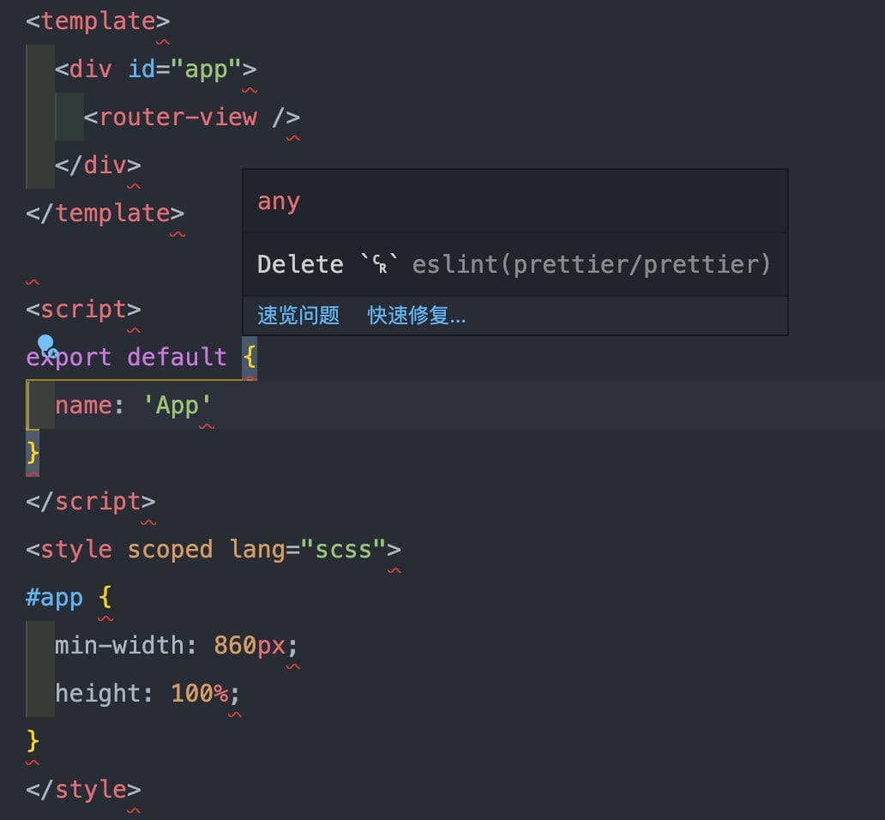

# Git 中换行符带来的问题

## 问题背景

Linux 和 Mac 系统的默认换行符统一为 `LF`，即 `\n`。而 Windows 系统，默认的换行符是 `CRLF`，即 `\r\n`。

实际码代码时，产出的代码中的换行符，会因为系统、编辑器等产生差异，这是个很细微的问题，但是也会带来一些困扰。比如：

1. Windows 开发者 clone 了一个 Mac 开发者搭建的项目时，如果项目中使用了 ESlint，并且 ESLint 的 `end_of_line` 配置用的是默认的（即 `lf`），那么代码会全篇爆红，报错提示为 `Delete`␍`eslint(prettier/prettier)`。



2. 如果开发者启用了 VScode 或其他编辑器的保存格式化功能，并且项目中存在上述的换行符问题，在开发者只修改了一行代码的情况下，保存的时候，全篇的代码都会被更正为当前开发环境的换行符。造成的后果显而易见，明明只改了一行代码，但实际上每一行的代码都被修改了，Git 提交版本时，会覆盖掉协作者的代码。

## 认识一下 Git 的 `core.autocrlf` 配置

- `true`：
  提交时转换为 `LF`，检出时转换为 `CRLF`
  ```shell
  git config --global core.autocrlf true
  ```
- `input`：
  提交时转换为 LF，检出时不转换
  ```shell
  git config --global core.autocrlf input
  ```
- `false`：
  提交检出均不转换
  ```shell
  git config --global core.autocrlf false
  ```

## 解决方案

换行符问题的解决，要从几个方面去着手：

- 开发者所使用的系统
- Git 的 `core.autocrlf` 配置
- 编辑器的换行符配置
- 项目中 ESLint 的 `end_of_line` 配置

Mac 开发者不用纠结，`core.autocrlf` 配置为 `input`，告诉 Git 在提交时转换为 LF，检出时不转换；编辑器也配置换行符为 `lf`。

Windows 开发者需要纠结下，ESLint 的配置会影响到 Windows 开发者的配置方式——

### 假设项目中关闭了 ESLint 的 `end_of_line` 校验

Windows 开发者可以配置 `core.autocrlf` 为 `true`，告诉 Git 在提交时转换为 `LF`，检出时转换为 `CRLF`；编辑器也配置换行符为 `crlf`。

另外贴一下 ESLint 关闭方法：

```js
// .eslintrc.js
module.exports = {
  rules: {
    end_of_line: 'off'
  }
}
```

如果项目中使用了 Prettier，设置 `endOfLine` 规则为 `auto`：

```js
// .prettierrc.js
// 如果你的项目用到了 prettier
module.exports = {
  // 每行结尾换行符号设置为 auto
  endOfLine: 'auto'
}
```

### 假设项目中开启了 ESLint 的 `end_of_line` 校验

首先建议 `end_of_line` 配置为 `lf`，因为公司的 GitLab 一般部署在 Linux 服务器，其次 LF 比 CRLF 毕竟少一个字符。这是大前提。

这时，Windows 开发者可以配置 `core.autocrlf` 为 `false`，告诉 Git 在提交和检出都不转换；编辑器配置换行符为 `lf`。

ESLint 默认配置就开启了 `end_of_line` 校验，并且默认值为 `lf`。

如果项目中使用了 Prettier，设置 `endOfLine` 规则为 `lf`：

```js
// .prettierrc.js
// 如果你的项目用到了 prettier
module.exports = {
  // 每行结尾换行符号设置为 lf
  endOfLine: 'lf'
}
```
