# 使用 PhotoShop CC 资源生成器“光速”切图

资源生成器（Extract Assets）是 Photoshop CC 2014 版本及以后版本新增的一个特性，它可以快速的导出 JPG、PNG、GIF、SVG 等丰富的图像资源。

## 简单使用

大概分为三个步骤：

::: tip 提示
第一步正常情况下只需要操作一次，以后就不需要重复设置了。
:::

1. 首选项 -> 增效工具，勾选【启用生成器】

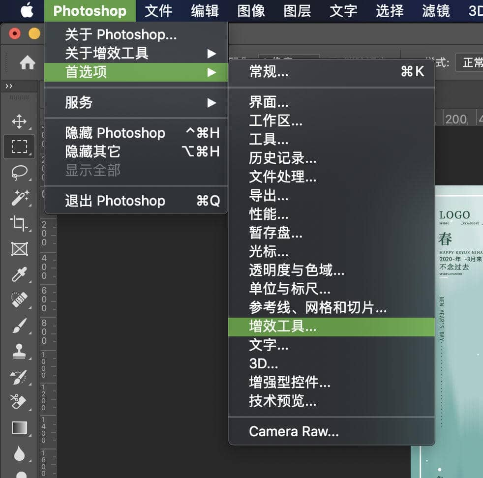

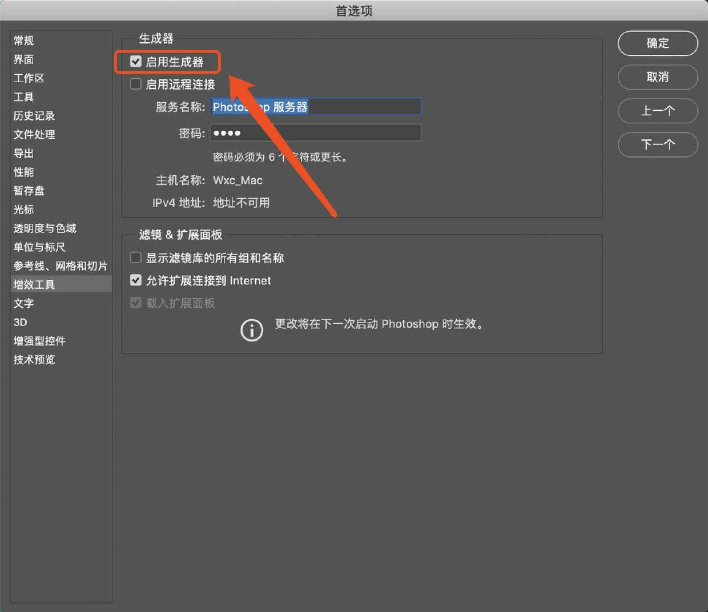

2. 文件 -> 生成，勾选【图像资源】

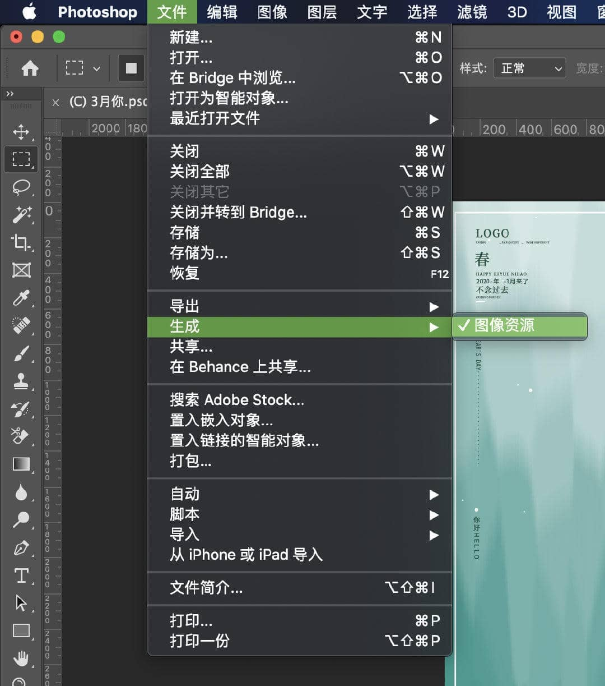

3. 修改图层或图层组合的名称，后缀为某一种图片格式的后缀

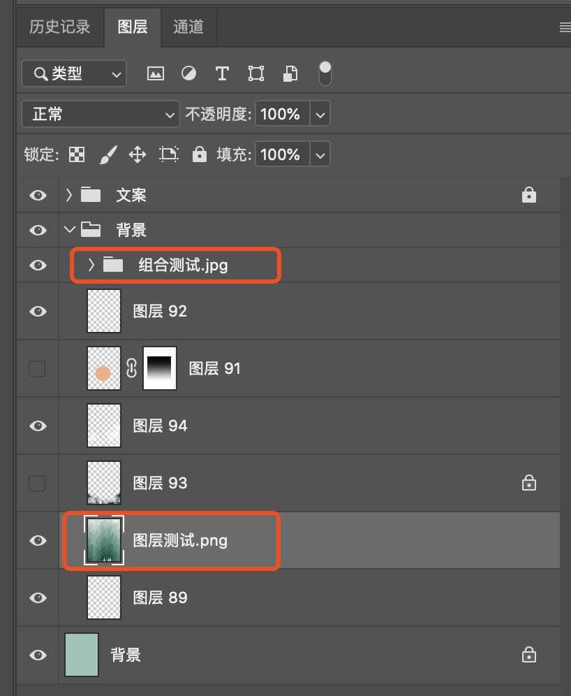

在你改完名字的那一瞬间，其实切图工作已经完成了。资源生成器会在当前 PSD 文件所在的目录下，生成一个 psd 文件名拼接上 `-assets` 的资源文件夹。

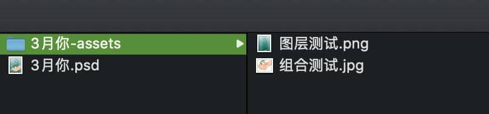

可以看到，刚刚我们改名的组合和图层，已经生成好了。

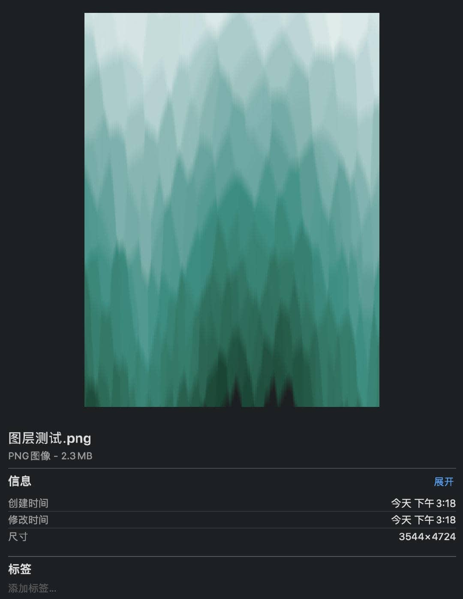

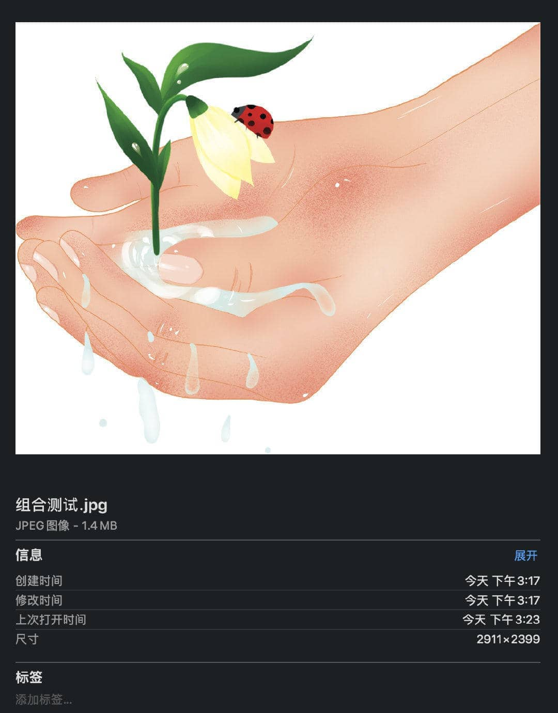

::: tip 注意
资源生成器切图，切图很快，但偶尔也会栽跟头。原因出在 UI 设计稿上。如果用于切图的 PSD 稿件图层混乱，模块分割不明朗，就很难用资源生成器进行切图了，最后只能祭出【切片工具】进行切图......所以，首先要学会佛系，其次要学会因地制宜。
:::

## 高级用法

### 一个图层或组合生成多种图片资源

使用英文逗号隔开几个名称即可。如：`图层测试.png,图层测试.jpg,图层测试.jpeg`

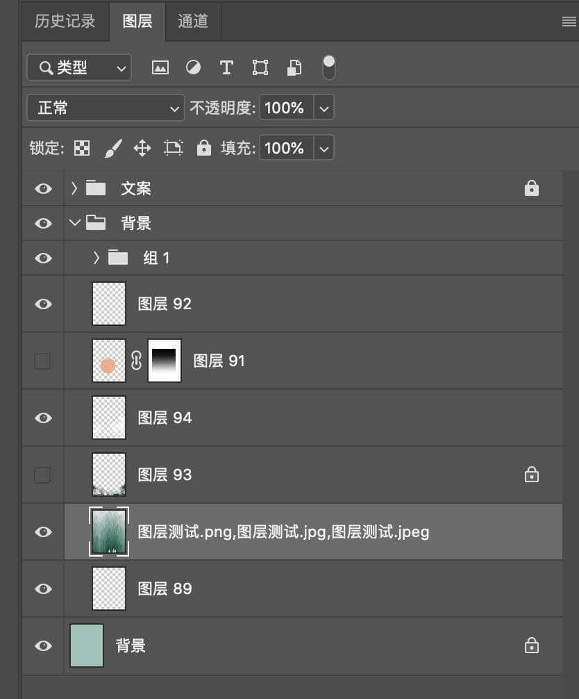

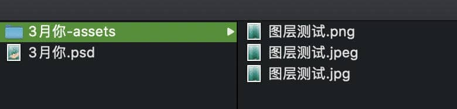

### 分类保存图片资源

可以通过特殊的命令方式，把同一类型的图片资源划分到相同的字文件夹中，如：`子文件夹名/图层测试.png`

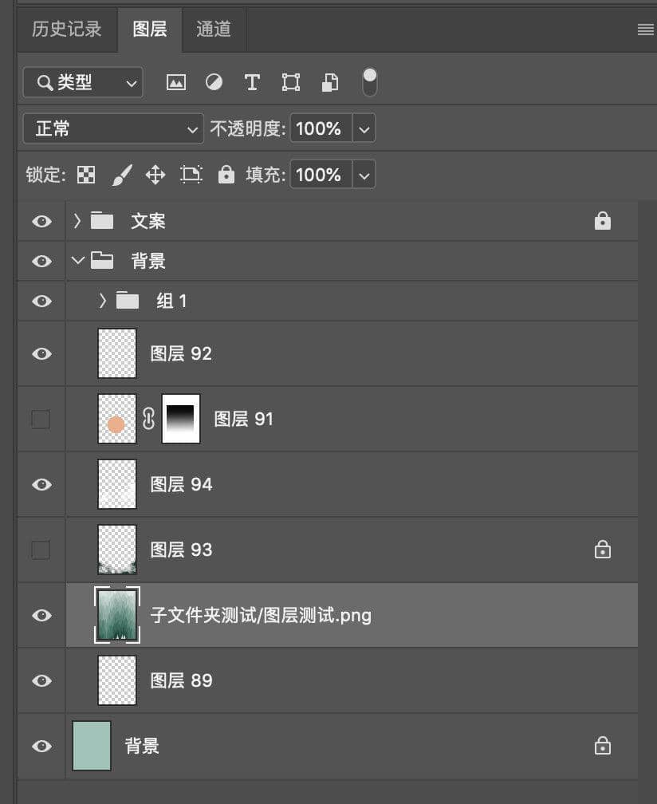

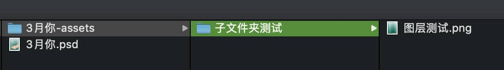

### 控制图片品质和尺寸大小

默认情况下，JPEG 资源会以 90% 品质生成，PNG 资源会以 32 位图像生成， GIF 资源会以基本 Alpha 透明度生成。

- 在名称前面添加前缀，以控制图片尺寸，前缀和名称之间必须有空格。。前缀可以是 `90%`、`120%` 这样的百分比值，表示缩放；也可以直接指定具体的尺寸，如 `100 x 100`、`100px x 200px`、`200mm x 300cm` 、`300x100`。经测试（PS cc 2019），`x` 大小写随意，`x` 前后的空格有没有都可以，尺寸数值后面的单位可以是 `px, in, cm, mm`，如果没有指定单位，默认单位是像素 `px`。

```bash
90% 图层测试.jpg
200mm x 300cm 图层测试.jpg
```

- 在名称后面添加后缀，以控制图片品质，后缀和名称之间不要有空格。。后缀可以是 `1 - 10` 的数字，也可以是 `1% - 100%` 的百分比值。
```bash
图层测试.jpg5
图层测试.jpg50%
```
