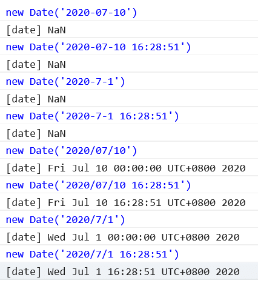

# 前端开发中的日期格式

## 概念罗列

在前端开发中，对于日期的处理往往没有想象中简单。这里面涉及到几个概念：

- GMT
- UTC
- 时间戳
- ISO-8601

以上四个名词是我认为比较关键的名词，理解它们，能很好得帮助我们处理日期格式。

## 格林威治标准时间 GMT 和 世界协调时间 UTC

之所以把这两个概念放在一起，是因为它们其实约等于同一个概念。

首先我需要声明，GMT 和 UTC **并不是日期格式** ——我有很长的一段时间都是把它们理解为是两种日期格式，但其实这个理解是完全错误的。

它们其实是两种时间标准。或者说是两种规范准则。它们定义了某时某刻的 **世界标准时间** 应该是多少。什么是世界标准时间？指的是 0 时区的时间。各国各地区的时间都是以这个世界标准时间为基础，加减上时区偏移的数值，换算过来的。

假设此时此刻的世界标准时间是 `2020年7月10号 16:28:51`。那么，此时此刻的北京时间是 `2020年7月11号 00:28:51`。GMT 和 UTC 这两种标准背后有着相应的计算逻辑，计算出了当前的世界时间必须是 `2020年7月10号 16:28:51`，这个时间点也可以书写成 `Fri, 10 Jul 2020 16:28:51 GMT`，怎么表示都可以，只要能表明年月日时分秒。

GMT 是前世界时间的标准，UTC 是现代世界时间的标准。从精确度来讲，UTC 要比 GMT 更精准一些。但是实际上二者的差别非常微小。并且一般日常生活中说时间只会说到秒，体现不出二者的差别。所以一般认为 GMT 和 UTC 等同。

## 时间戳 Timestamp

::: tip 提示
时间戳是指 以 GMT（格林威治标准时间） 为标准，从 1970 年 1 月 1 日开始算起，到当前时间的 **总秒数/总毫秒数**。
:::

既然是在 GMT 的基础上做的计算，那么时间戳本身就是与时区无关的一个数值。

依旧假设此时此刻的时间是 `2020年7月10号 16:28:51`，这个字符串并不能明确表示出所在的时区，在美国和在美国说出这个时间，那代表的时刻就完全不一样，中间相差近 12 个小时。

假设此时此刻的时间戳是 `1594398531000`，那么不管我在美国还是在中国，它都是代表了同一个时刻。

如果你需要开发一个国际项目或者服务器设置的时区与客户端不一致时，那么前后端可以事先把时间处理成时间戳，再进行前后端交互。这样就不会产生时区的错乱。

## ISO-8601 国际标准时间格式

跟 GMT 和 UTC 不同，[**ISO-8601**](https://www.iso.org/iso-8601-date-and-time-format.html) 代表的是一种时间字符串的格式。

以前面的世界标准时间 `2020年7月10号 16:28:51` 为例，用 ISO-8601 规定的格式可以写作：

```js
// UTC 标准时区
'2020-07-10T16:28:51.815Z'
'2020-07-10T16:28:51Z'

// UTC 标准时区+8
'2020-07-10T00:28:51.815+08:00'
'2020-07-10T00:28:51+08:00'

// UTC 标准时区+8
'2020-07-10T00:28:51.815+0800'
'2020-07-10T00:28:51+0800'
```

- 其中 `T` 是年月日和时分秒之间的分隔符。
- 如果表示的是 UTC 标准时区，末位以 `z` 结尾，代表了 0 时区。
- 如果想要表示时区，比如东八区，末位去掉 `z`，追加 `+08:00` 或者 `+0800`。这更像是一种注解，它表示前面的 `2020-07-10T00:28:51` 是东八区时间。
- `.815` 代表毫秒数，有了更精确，没有就代表 0 毫秒。
- 其实还有一种 basic 格式的写法：`20200710T162851`。但经过我的尝试，浏览器并不能解析这种格式，实际也很少见，所以不赘述。

[**ISO-8601** 官网](https://www.iso.org/iso-8601-date-and-time-format.html) 阐述了 ISO-8601 一个作用：

::: tip 官网释义
It gives a way of presenting dates and times that is clearly defined and understandable to both people and machines.（它提供了一种清晰明了显示日期和时间的方式，使人和机器都可以理解。）
:::

按照官网所述，这种格式既可以让人理解顺畅，又可以让机器理解。

### ISO-8601 的兼容性

我们来看看，ISO-8601 格式在浏览器中的表现:

- Chrome


- Safari


- Firefox


- IE


显然 IE 全军覆没。有什么办法可以使 ISO-8601 兼容 IE 呢？

除了通过 `new Date()` 或 `Date.parse()` 去解析 ISO-8601 时间字符串，我们还可以借助第三方的 **时间处理插件**。

下面我来讲解三款常用插件对于 ISO-8601 格式的解析：

### Moment.js 解析 ISO-8601

作为老牌的日期时间处理工具，[Moment.js](http://momentjs.cn/) 可谓鼎鼎大名。

Moment 从 2.7.0 版本开始，提供了针对于[特殊格式的解析](http://momentjs.cn/docs/#/parsing/special-formats/)功能

- 解析 ISO-8601

```js
moment('2020-07-10T16:28:51Z', moment.ISO_8601)

moment('2020-07-10T00:28:51+08:00', moment.ISO_8601)
```

- 格式化成 ISO-8601

```js
moment().utc().format('YYYY-MM-DDTHH:mm:ss.SSS[Z]') // 2020-07-10T16:28:51Z
// or
moment().toDate().toISOString() // 2020-07-10T16:28:51Z
```

### date-fns 解析 ISO-8601

相比于 Moment.js 的笨重，[date-fns](https://date-fns.org/) 更像是一个年轻的小伙。它可以按需引入，彰显模块化的优点。

- 解析 ISO-8601

```js
import { parseISO } from 'date-fns'

parseISO('2020-07-10T16:28:51Z')

parseISO('2020-07-10T00:28:51+08:00')
```

- 格式化成 ISO-8601

```js
import { formatISO } from 'date-fns'

formatISO(new Date()) // 2020-07-10T16:28:51Z
```

### Day.js 解析 ISO-8601

相比于 Moment.js 和 date-fns 的功能全面，[Day.js](https://day.js.org/) 就显得异常轻量。它的核心包只有 **2k** 大小。

正因为太简约，dayjs 的核心包功能并不具备解析 ISO-8601 格式的功能。需要引入相应的辅助插件：

- 解析 ISO-8601

```js
import dayjs from 'dayjs'
import customParseFormat from 'dayjs/plugin/customParseFormat'
dayjs.extend(customParseFormat)

dayjs('2020-07-10T16:28:51Z', 'YYYY-MM-DDTHH:mm:ss.000ZZ')

dayjs('2020-07-10T00:28:51+08:00', 'YYYY-MM-DDTHH:mm:ss.000ZZ')
```

- 格式化成 ISO-8601

```js
dayjs().format() // 2020-07-10T00:28:51+08:00

// or

dayjs().format('YYYY-MM-DDTHH:mm:ssZ[Z]') // 2020-07-10T16:28:51Z

// or
import dayjs from 'dayjs'
import utc from 'dayjs/plugin/utc'
dayjs.extend(utc)
dayjs().utc().format() // 2020-07-10T16:28:51Z
```

## 其他开发中常用的日期格式

```js
'2020-07-10'
'2020-07-10 16:28:51'

'2020-7-1'
'2020-7-1 16:28:51'

'2020/07/10'
'2020/07/10 16:28:51'

'2020/7/1'
'2020/7/1 16:28:51'
```

### 兼容性

先来看看兼容性：

- Chrome


- Safari


- Firefox


- IE



这回不光 IE 撂担子，Safari 居然也开始抽风。怎么解决呢？只能又来依赖于第三方的 **时间处理插件**。

### 解决方案

这里我只提供思路，不再赘述。思路就是手动拼出该日期字符串所对应的格式进行解析，例如：

```js
moment('2020-07-10 16:28:51', 'YYYY-MM-DD HH:mm:ss')
```

::: info 写在最后
假设你遇到了，同一个接口，后端返给你的字段各种各样格式都有，那可能是后端表里的字段直接存的是字符串格式，这需要你跟后端打一架让他修正。
:::
