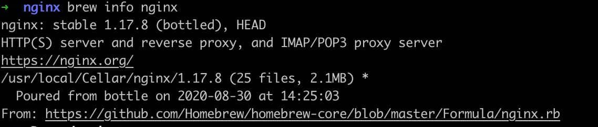
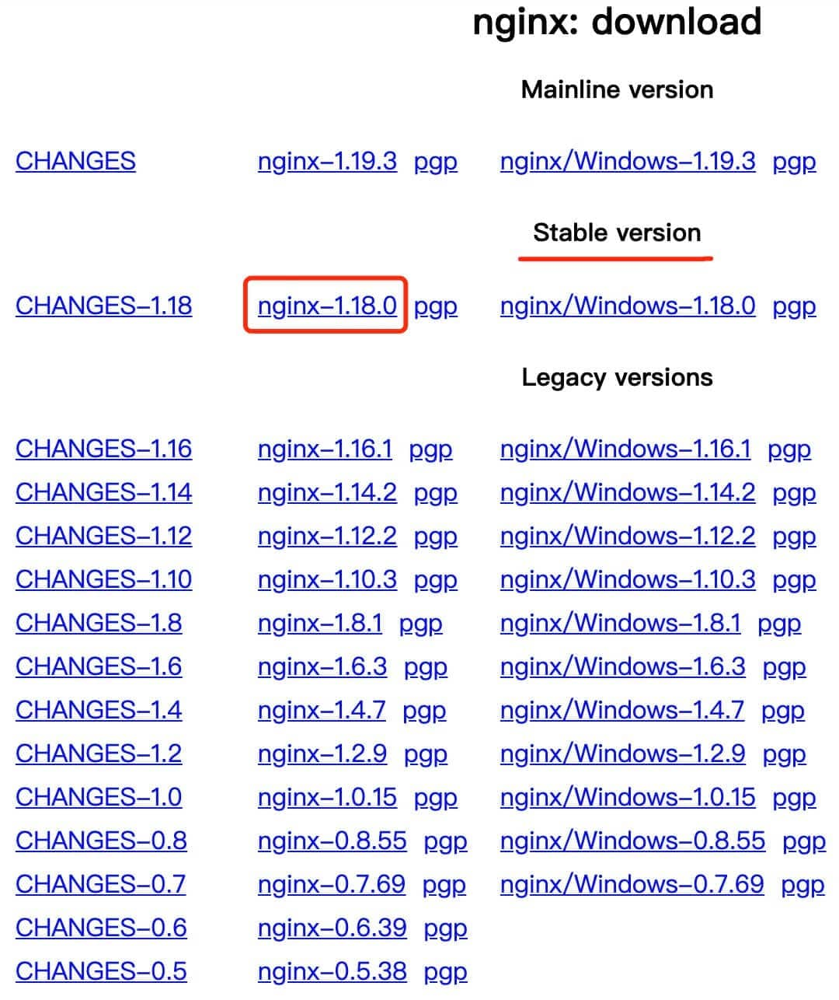
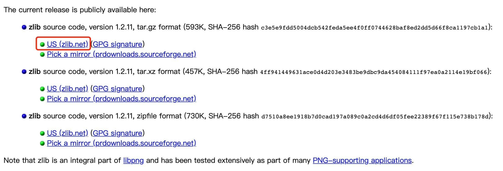
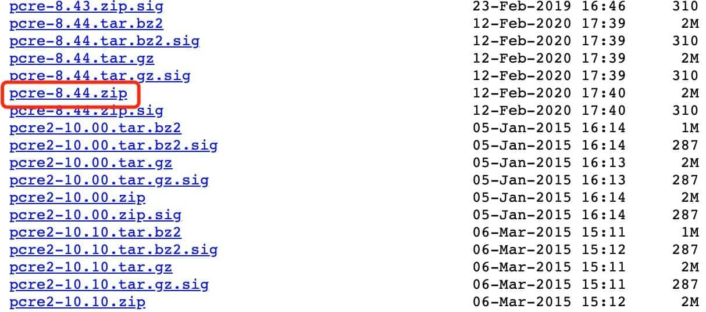
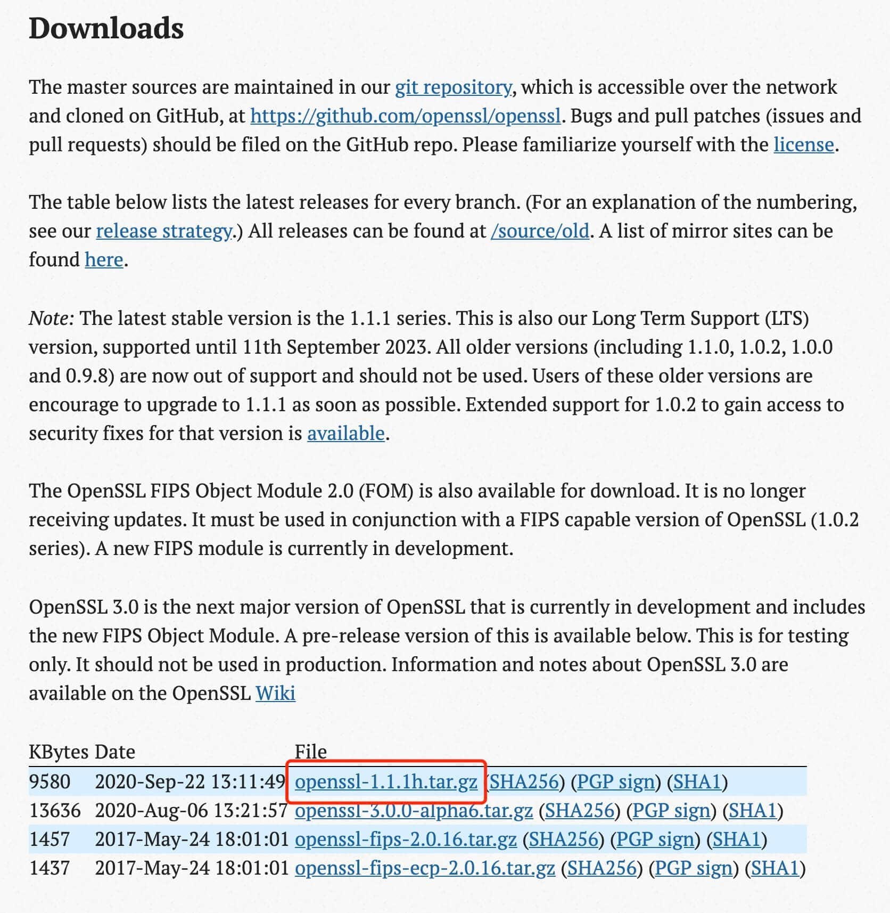
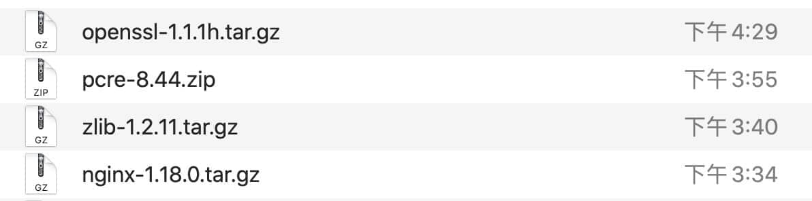
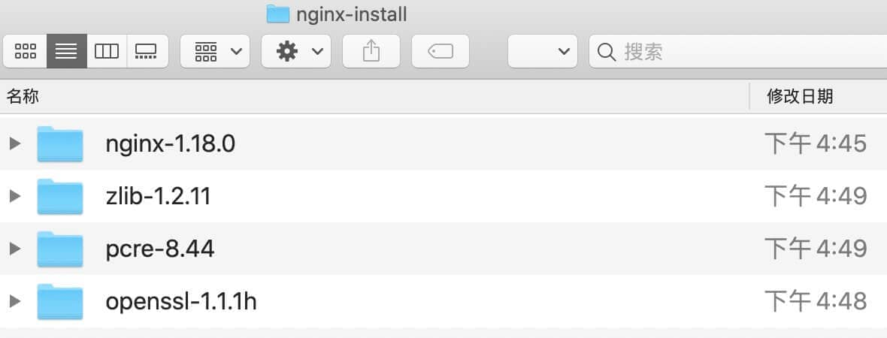
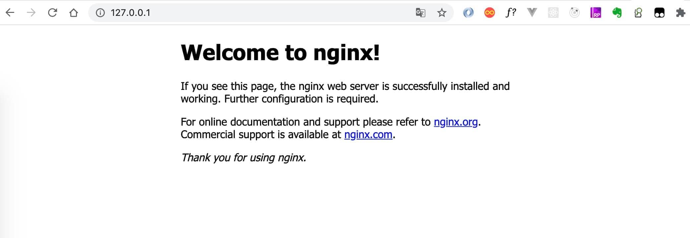

# MacOS 安装 nginx-1.18.0

目前网上很多的教程都是通过 [`Homebrew`](https://brew.sh/) 去安装，我试过之后，发现安装的 nginx 版本不是最新稳定版。

并且配置文件所在目录也和最新稳定版有挺多出入，所以只能自己动手丰衣足食。



## 准备工作

### 1. 下载最新稳定版本的 [nginx](https://nginx.org/en/download.html)

目前的稳定版本为 `nginx-1.18.0`



由于 nginx 官方没有提供 macOS 版本的快捷安装包，所以只能下载源码包。

### 2. 下载依赖包 [zlib](https://zlib.net/)

我下载的是当前的最新版本 `zlib 1.2.11`



### 3. 下载依赖包 [pcre](https://ftp.pcre.org/pub/pcre/)

**注意：** 不能下载最新的 2-x 版本（这个工具的版本号属实有点混乱），不兼容 nginx-1.18.0



### 4. 下载依赖包 [OpenSSL](https://www.openssl.org/source/)

我下载的版本是当前的最新版本 `openssl-1.1.1h`



## 编译安装

### 1. 解压缩下载的四个压缩包到一个新建目录

新建目录的名字随便起，位置随便放，等 nginx 安装完成之后，可以直接删除。比如我的就叫 `nginx-install`，放在了下载目录





### 2. 打开终端 `cd` 到 nginx 源码目录

```bash
cd Downloads/nginx-install/nginx-1.18.0
```

### 3. 配置 `configure`

复制以下命令，修改成自己的文件名，粘贴到终端，回车

```bash
./configure --prefix=/usr/local/nginx \
--with-http_ssl_module \
--with-pcre=../pcre-8.44 \
--with-zlib=../zlib-1.2.11 \
--with-openssl=../openssl-1.1.1h
```

### 4. 编译 `make`

等上一步配置完毕，输入以下命令，回车

```bash
sudo make
```

### 5. 安装 `make install`

等上一步编译完毕，输入以下命令，回车

```bash
make install
```

## 测试启动

```bash
cd /usr/local/nginx

# 启动
sudo sbin/nginx
```

启动完毕后，打开浏览器，输入 IP `127.0.0.1`，回车，看到以下页面，即启动成功



自此安装完毕，尽情玩转 nginx 吧

ps: `nginx-install` 目录也可以直接删除了
